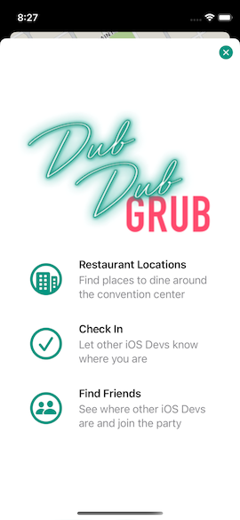
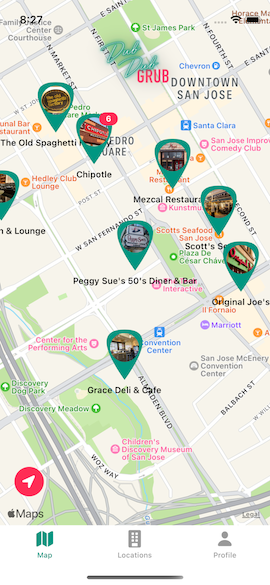
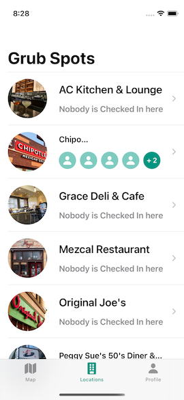
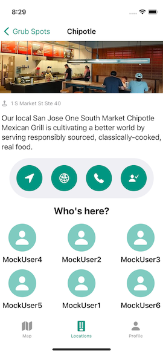
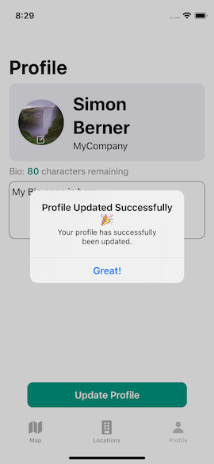

# Dub Dub Grub - 2022
Dub Dub Grub (a course by Sean Allen) is my current work in progress project for taking the next (more advanced) steps in learning Swift and SwiftUI.
It is a exploration of the frameworks *CloudKit* and *MapKit*.

## Purpose
Dub Dub Grub let Apple Developer's who visit [WWDC](https://apple.fandom.com/wiki/Worldwide_Developers_Conference) at the San Jose Convention Center,
check-in/out at nearby restaurants/bars to meet like-minded developers.
### Rules
- A user which is signed-in to its iCloud account, can only checked-in to one location (Restaurant, Bar) at a time. If they check-in to another location,
they get automatically checked-out of the location there where checked-in before.
- A user can update its profile only when they are signed in to their iCloud account.

## Naming
The annual developer convention hosted by Apple where they talk about all the new stuff coming for developers, is called the
Apple World Wide Developer Conference or “WWDC” for short. People commonly call this event “Dub Dub” as a shortened form of “WWDC”.

- WWDC = “Dub Dub”
- Food you eat = “Grub”

Therefore: “Dub Dub Grub”

(Siri pronounces WWDC as "dub-dub-dee-see")

## Notes
Dub Dub Grub is from a functional perspective a pretty big App. So far I have invested tons of hours to build it and trying to understand what
exactly happens with each line of code I am writing. I am on the same side as Sean: first build it and make it work, and then in a next (or later step)
refactor it to make the code pretty 😁

## Screens

## Test Flight
Not planned (yet)

## App Store
This app won't be available in the App Store.

## Used Technologies
- Swift 5.5
- SwiftUI
- [CloudKit](https://developer.apple.com/icloud/cloudkit/)
- [MapKit](https://developer.apple.com/documentation/mapkit)
- [CoreLocation](https://developer.apple.com/documentation/corelocation)
- [Async/Await](https://www.avanderlee.com/swift/async-await/)
- OSLog
- [Async await](https://www.hackingwithswift.com/swift/5.5/async-await)
- XCTest

## Architecture
- MVVM

## A word on 3rd Party Libraries
By not using 3rd party libraries in your project, you are going to learn more. Especially if it is a small projects. Unless you
specifically want to experiment with certain libs. Be aware that someone might ask: Did you write any of this code on your own
or did you just use libraries?

## Requirements
### Using the App
- An iCloud account is needed in order to use all the features
- The user has to have connectivity in order to use the App
### Development
- An Apple Developer membership is required to develop on the App
- If you want to build your own Dub Dub Grub App based on this repo, be aware of that you have to setup the following:
    - Create your own iCloud DubDubGrub container
    - Build the DB-Schemas for DDGProfile, DDGLocation and create a userProfile Reference in the existing Users record

## Learnings
### Swift
Which Swift version is the current latest? And which is currently in development? Here a great overview:
- [Swift Version](https://swiftversion.net/)
### CloudKit
CloudKit is essentially Apple's 1st party version Backend Service (similar to Google's [Firebase](https://firebase.google.com/)).
It is available on all Apple Platforms.
#### Pros
- It does not have any scaling issues because Apple uses it for its own apps (Notes, News, Photos, WWDC)  with millions of users.
- It is free (up to certain limit) if you have signed up to the Apple Developer Program
- Automatic Authentication (it is linked to the users iCloud account)
- Sync of data across devices
- Sharing with others functionality out of the box
- Apple Privacy if that is important for your App
- Apple's 1st party supported framework
- Import CloudKit and you are good to go
#### Cons
- Apple Only (if you are considering also to provide an Android App)
- You need to have an [Apple Developer Account](https://developer.apple.com/support/compare-memberships/) which costs $99/year in order to use CloudKit.
- If you are using CloudKit with your App, you cannot Transfer (give away to someone else) that App without the specific Apple Developer Account bound to it.
(To get around this issue, you can create a new specific Apple Developer Account for the App and pay another yearly fee of $99/year.)
- It is not possible (obviously this is a limitation of CK) to filter out nil values (for this App the kIsCheckedIn field) when querying the database.
- If an App would benefit from having a lot of server-side logic, CK might not the best route to go with, because you would have to build the logic on the client side then.
#### Terminologies and Definitions
- Within an Apps Container there are three main databases: Public, Private, Shared
    - Public: every user of the app can see that data (eg. the locations in the DubDubGrup App)
    - Private (Apple level privacy): user specific data (not visible to the Developer)
    - Shared: data (eg. photo albums) is shared between users
- Record Type (eg. DDGLocation)
    - CKRecord is an instance of that type (eg. Chipole) and lives in the Public or Private database
    - CKRecord.Reference creates a pointer to a CKRecord
    - DubDubGrub: DGGProfile will have a reference to a DDGLocation
    - CKOperation is the work horse of CloudKit and is used for CRUD operations on CloudKit
#### Record Types
- The 'Users' record type is what you get with the automatic authentication. As soon as somebody comes with an iCloud account, it creates
a record of this type. The restriction though is, that you can't query it. That is why we have to create a DDGProfile object.
- As a custom field, we have to add a userProfile as a reference to the DDGProfile object.
- We have to define which fields of a Record Type are searchable, queryable or sortable
#### Project specifics
- When starting the App, all the DDGLocations and DDGProfiles are retrieved from CloudKit.

### MapKit & CoreLocation
- They are independent frameworks but go very good hand in hand
#### MapKit
- ...
#### CoreLocation
- With CoreLocation we can get access to: GPS, Wi-Fi, Bluetooth, Barometer, Celluar to get infos like: Location, Altitude, iBeacons, Region, Monitoring
- The CLLocationManager delivers all the necessary location-events to an App

### Async await (since Swift 5.5)
- [Async await](https://www.avanderlee.com/swift/async-await/)
- [@MainActor](https://www.avanderlee.com/swift/mainactor-dispatch-main-thread/)

### Note on learning from videos
Rewatching videos after I have build and experimented with a certain framework, they make so much more sense to me.

### Initializers
- Pro tip: put your custom initializer in an extension if you want to keep the memberwise initializer.

### Logging in Swift (>iOS14)
- [OSLog is the future of logging](https://www.avanderlee.com/workflow/oslog-unified-logging/#improved-apis-in-ios-14-and-up)

### Extensions
- [Extensions can add new computed properties, but they can’t add stored instance properties (static are allowed), or add property observers to existing properties.](https://docs.swift.org/swift-book/LanguageGuide/Extensions.html#ID152)
- [Stored properties in extensions - old post from 2017](https://medium.com/@marcosantadev/stored-properties-in-swift-extensions-615d4c5a9a58)
- [We can add Subscripts to a Type](https://docs.swift.org/swift-book/LanguageGuide/Extensions.html#ID156)

### Design Patterns and Architectures
Design patterns and architectures are guidelines with the purpose to make your code as flexible, maintainable, testable, understandable
and clean as possible for your context. You don't have to follow them at all costs!
- [Swift design patterns and iOS architectures](https://theswiftdev.com/the-ultimate-viper-architecture-tutorial/)
#### MVVM
- Model: reflects the data layer
- View: the view layer shows what the ViewModel is publishing
- ViewModel: the business logic is an ObservableObject (final class) where Views can subscribe (observe) to. It connects the View with the Model
#### Singleton
- Can be seen as a global variable
- Everyone has access to the same instance
- Very easy to use
- Be aware, that it can be dangerous, because it is hard to debug as it can be accessed and changed from anyone!
- Use them strategically

### Error handling
- [do, try, catch](https://www.hackingwithswift.com/new-syntax-swift-2-error-handling-try-catch)

### GeometryReader
Shall we use the GeometryReader for our custom views or not? I am a bit confused now from these to conflicting posts:
- [Paul Hudson - Understanding frames and coordinates inside GeometryReader](https://www.hackingwithswift.com/books/ios-swiftui/understanding-frames-and-coordinates-inside-geometryreader)
- [Swift with Majid - How to use GeometryReader without breaking SwiftUI layout](https://swiftwithmajid.com/2020/11/04/how-to-use-geometryreader-without-breaking-swiftui-layout/)

### Environment Object
- [@EnvironmentObject](https://www.avanderlee.com/swiftui/environmentobject/#what-is-an-environmentobject)

### MainActor
- [MainActor (since Swift 5.5) performs tasks on the main thread](https://www.avanderlee.com/swift/mainactor-dispatch-main-thread/)

### Communicating with UIKit
- In SwiftUI we use a so called 'Coordinator' to communicate with UIKit.

### Struct vs Class
- A Struct (value type) is a disposable. It does not persist anything. We us it and then get rid of it.
- A Class is for keeping an instance alive (persisting objects for an entire session).

### Holy Coding Principles
One should not always follow [coding principle](https://www.makeuseof.com/tag/basic-programming-principles/) at all costs.
- [DRY is good](https://thevaluable.dev/dry-principle-cost-benefit-example/) but repeating yourself a little bit can make your code easier to read and use.
- [Dedicate individual posts for these principles](https://medium.com/swift-india/solid-principles-for-ios-developers-3f8919c78b30)

### Crashing an App
- Never letting an App crash, might not be the best idea in certain situations
- There are situations, eg. when the App gets into a funky weird state where it should never be in, where it is ok to let the App crash,
rather than trying to gracefully handle the error and continue on. It is best to let go and restart fresh.

### DocC
- With [DocC](https://developer.apple.com/documentation/docc) we can document the code we write and by the way produce a rich API
reference documentation and interactive tutorials.

### God Mode
- God Mode in the context of this App is, when you have access to the CK database admin tool and you can enter the data directly without going
through the Apps UI 😁 

### Cleanup and code styling
- It is so important having a clean and well organized codebase. So don't forget to cleanup your pieces of code once in a while, before going on to a next feature.
- A clean and well organized codebase sets the tone for new people joining a project.

### The first 90?

### The second 90% (are coming)
The second 90% add up and reflect the todos, to "finish" the development efforts to be ready for a first launch.
EDGE CASES:
- Thorough robust error handling in place?
- How do we handle a poor network connection?
- What happens when users are start banging at the app?
- Refactoring in general: make it the code better and better
- Polish: animations, empty states
- All Screen Sizes
- Accessibility features?
- Accessibility ID's for UI Testing?
- TDD (Unit/Integration Tests)?

### Haptics
- [Haptics engage people’s sense of touch to enhance the experience of interacting with onscreen interfaces. ](https://developer.apple.com/design/human-interface-guidelines/ios/user-interaction/haptics/)
- Add haptics only to significant, consequential interactions
- Make haptics optional (this would require a settings screen to turn them off)

### Accessibility & Inclusive Design
#### Voice Over
- If your development resources are limited, you can strive for complete accessibility over time.
You don't want to have finished everything in your initial MVP.
- Start by adding the basics (eg. the low hanging fruits in voice over) of accessibility to your app.
- It takes you (only) a couple of hours to improve the accessibility of a small App from bad to good .
- Strive for a complete accessible App over time
- If you are finished with your first iterations of accessibility improvements, try to track down a voice over user for testing.

#### Dynamic Type
- Allows a user to choose their preferred Text Size (Settings -> Display&Brightness -> Text Size)
- Larger text sizes are available in the Accessibility Settings
- Your App should [support Dynamic Type](https://blog.timroesner.com/supporting-dynamic-type)

### @ViewBuilder
- In order to return two different views from a function in SwiftUI, you have to annotate the function with @ViewBuilder
- Lets us return a specific view but it doesn't matter which type
- [Adding SwiftUI’s ViewBuilder attribute to functions](https://www.swiftbysundell.com/tips/adding-swiftui-viewbuilder-to-functions/)

### Weak Self?
- Although we have [Automatic Reference Counting](https://docs.swift.org/swift-book/LanguageGuide/AutomaticReferenceCounting.html) in place, we still need to manage reference types (class members) to prevent retain cycles (strong reference cycles).
- By setting weak in front of a class member, we tell the ARC to release the strong reference for it. Thus memory will be freed up.
- Weak references are always declared as optionals as they can automatically be set to nil by ARC when its reference is deallocated.
- By adding weak by default you probably end up working with optionals in a lot of cases while it’s actually not needed.

### Async/Await
- try? (optional try) will return nil in case an error is thrown

## Deprecations
- [SwiftUI Deprecated Modifiers](https://developer.apple.com/documentation/swiftui/view-deprecated)

## Code comments
For learning purposes, I have added lots of comments alongside the code. I am aware that this would probably be omitted at that extent in 'production' code 😉

## Credits
A big thanks to Sean Allen for his amazing teaching style and a rich filled and well structured course 👏🏼
